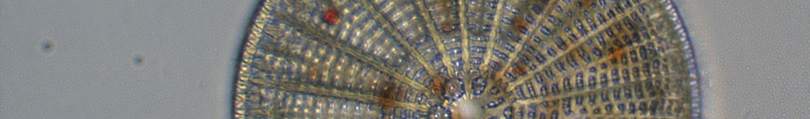

---
title:
date: 2026-03-16
---

  
  

    Contributions
  

### [Evidence of bumble bee extirpation and colonization: Galiano Island, British Columbia, Canada](https://www.researchgate.net/publication/377195063_Evidence_of_Bumble_Bee_Extirpation_and_Colonization_Galiano_Island_British_Columbia_Canada)

Community science platforms such as iNaturalist hold promise as a novel approach to tracking biodiversity change with reference to historical baseline data. In this paper, we present evidence for historical change in an island bumble bee community, documenting the probable extirpation of three bumble bee species and a recent colonization event. Results from intensive sampling using blue vane traps and from iNaturalist observations converged on the same estimate of species richness in the present community, which significantly differed from estimates of richness in the historical community. These results demonstrate the potential for community science to aid in the detection of biodiversity change through a comparison of historical collections and crowd-sourced biodiversity data.

### [IMERSS biodiversity data science portal]([https://imerss.github.io/imerss-bioinfo/)

We are working with communities throughout the Salish Sea to create open source tools for synthesizing, analyzing, and communicating biodiversity data. Our multidisciplinary, cross-cultural and transboundary partnerships bring together a diverse range of individuals and organizations to contribute to a shared vision for a more resilient and interconnected bioregion, including the [American Indian Higher Education Consortium](http://www.aihec.org/), [Átl’ka7tsem / Howe Sound Biosphere Region Initiative](https://www.howesoundbri.org/), [Canadian Institute for Ecology and Evolution](https://www.ciee-icee.ca/ldp.html), [Inclusive Design Research Centre](https://idrc.ocadu.ca/), [Transition Salt Spring](https://transitionsaltspring.com/), [Valdes Island Conservancy](https://valdes-island-conservancy.weebly.com/), and [Whiteswan Environmental](https://www.whiteswanenvironmental.org/). From this community of practice emerges inclusive frameworks that have enabled our partners to synthesize and communicate a range of data, honouring story telling as a practice of central importance in conveying the information that matters to communities.

[Access our open source code on GitHub](https://github.com/imerss/).

### [Toward an atlas of Salish Sea biodiversity](https://bdj.pensoft.net/article/76050)

We describe Galiano Island’s marine animal diversity in relation to the Salish Sea’s overall biodiversity and quantify the proportional contributions of different types of sampling effort to our current local knowledge. In summary, we find that the Pacific Marine Life Surveys, a regional community science diving initiative, account for 60% of novel records reported for Galiano Island. Voucher specimens account for 19% and crowd-sourced biodiversity data 18% of novel records, respectively, with the remaining 3% of reports coming from other sources. These findings shed light on the complementarity of different types of sampling effort and demonstrate the potential for community science to contribute to the global biodiversity research community. We present a biodiversity informatics framework that is designed to enable these practices by supporting collaboration among researchers and communities in the collection, curation and dissemination of biodiversity data.

Access our data on the [Global Biodiversity Information Facility](https://www.gbif.org/dataset/56687a3d-b48f-44e5-b2b8-d55bafff2f33).

### [Phylogenetic restriction of plant invasion in drought-stressed environments](https://onlinelibrary.wiley.com/doi/full/10.1002/ece3.7776)

Our curated biodiversity datasets have created baselines valuable for research focusing on changing biodiversity dynamics in the drought-stressed ecosystems of the southern Gulf Islands. Combining methods from pollinator research and phylogenetic community ecology, we tested the influence of environmental filtering over plant community phenology across gradients of landscape disturbance and soil moisture. Critical seasonal fluctuations in floral resources coincided with significant phylogenetic clustering in plant communities, with decreasing plant diversity observed under conditions of increasing drought stress. Exotic plant species in the Asteraceae became increasingly pervasive across the landscape, occupying a late season temporal niche in drought-stressed environments.

We acknowledge the legacy of the late Harvey Janszen, a naturalist whose contributions to the floristics of the southern Gulf Islands of British Columbia greatly benefitted this study. 

