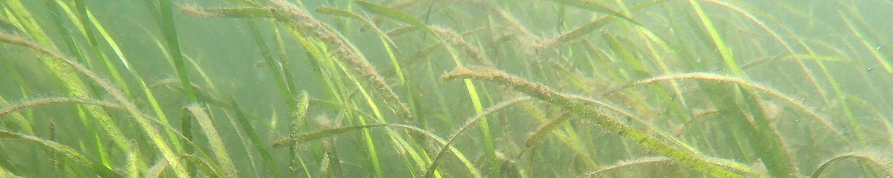

---
title:
date: 2026-03-16
---

  
  

    Media
  

### [Shining the light on baby crabs](https://hakaimagazine.com/features/shining-the-light-on-baby-crabs/)

A Hakai Magazine article by Spoorthy Raman featuring the Hakai Institute’s [Sentinels of Change](https://sentinels.hakai.org/) program, which is co-coordinated on Galiano Island by Jeannine Georgeson (IMERSS) and the Galiano Conservancy.

“For Georgeson, who is at the Whaler Bay dock almost every other day in the spring and summer to work with the trap, the motivation to be involved in the light trap monitoring project goes beyond science. It’s a way to connect with her culture, in which crabs hold a dear place, and to preserve family traditions, she says. She likens the work to her efforts to learn Hul’q’umín’um’, her family’s Coast Salish language. I ask her if she’ll continue to be involved in the project next year. ‘I’d love to do this for another 10 years,’ she says if that means preserving the Dungeness crab and its cultural significance for future generations. ‘I want my granddaughter to know what it’s like to be able to be a part of this.'"

### [A community’s quest to document every species on their island home](https://hakaimagazine.com/features/a-communitys-quest-to-document-every-species-on-their-island-home/)

A Hakai Magazine article by Marina Wang featuring the [Biodiversity Galiano](https://biogaliano.org/) project.

“Naming leads to knowing, which leads to understanding. Residents of a small British Columbia island take to the forests and beaches to connect with their nonhuman neighbors.”

