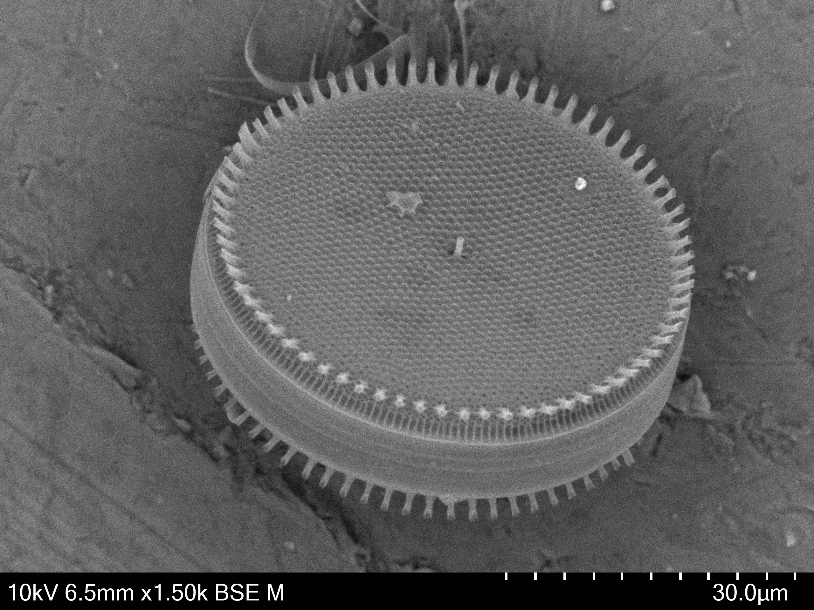

Diatoms are a major group of photosynthetic micro-algae living in marine and freshwater environments, which provide vast quantities of oxygen, food and nutrients for a wide range of organisms. The last regional diatom inventories were undertaken by Cupp (1943) for the West Coast of North America and Shim (1976) for the Georgia Strait, to the exclusion of many benthic and epiphytic species. This project aims to establish an updated taxonomic inventory of diatoms known to the Salish Sea, including detailed descriptions, discussions, observations and references. We apply light microscopy and Scanning Electron Microscopy (SEM) to determine species based on key taxonomic features. To extend this work, we are also exploring the application of third-generation molecular sequencing technology to barcode diatoms and promote community access to genomics research.

 
# Status

Project Initiated September 2012

Current status: Ongoing

 
# Partnerships

Mark Webber, Arjan van Asselt | IMERSS Labs

Elaine Humphrey | Advanced Microscopy Facility (UVic)

Alice Chang | UBC

 
# Resources 

[Salish Sea Diatoms on iNaturalist](https://www.inaturalist.org/observations?place_id=any&subview=grid&taxon_id=123880&user_id=lamamark&verifiable=any)

Thank you to [Hitachi High-Tech Canada Inc.](https://www.hitachi-hightech.com/ca/) for providing the Hitachi TM4000 Desktop Scanning Electron Microcope for work on this project in July 2020.
