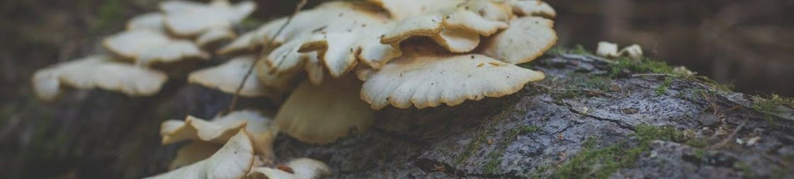
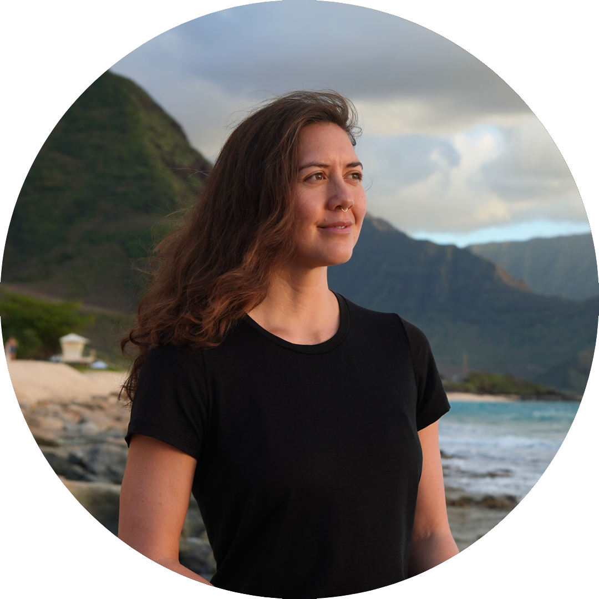
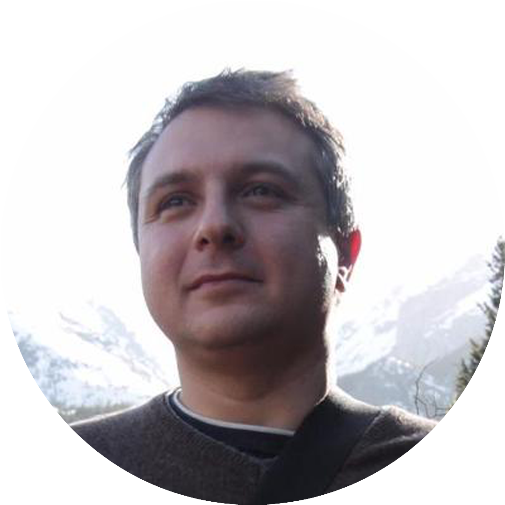
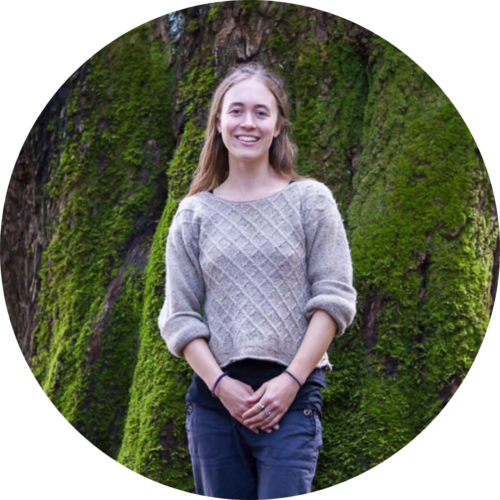
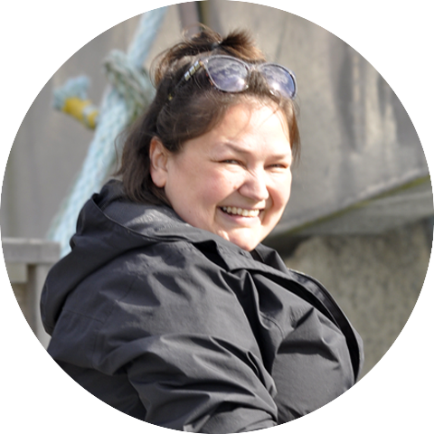
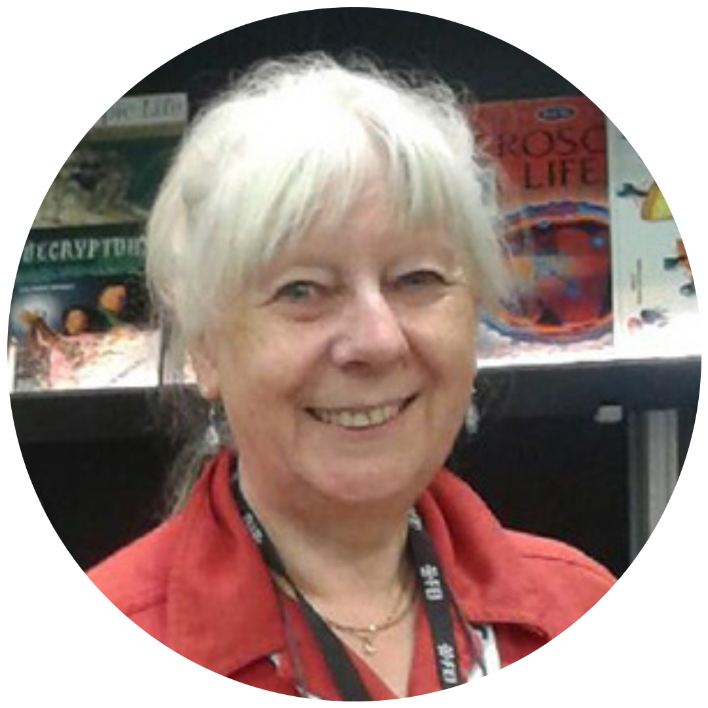

### Emily Adamczyk
*Chair and Marine Ecology Research Director*

Emily found her passion for ecology while growing up in the foothills of the San Gabriel mountains in Southern California. Her curiosity about the natural world led her to complete her B.S. and M.S. in Biology from the University of California, San Diego. Emily’s interest in coastal ecosystems prompted a northward move to Vancouver, BC, where she earned her Ph.D. in Zoology at the University of British Columbia. Her thesis focused on understanding the effects of human activities, space, and time on eelgrass-associated invertebrate and microbial diversity.

Emily enjoys sharing her love for nature with others and teaching science to folks of all ages. She believes education and community engagement are at the core of implementing effective and long-lasting management of coastal ecosystems. She is thrilled to share her personal objectives with IMERSS: science is for everyone. As Chair of the Board of Directors, Emily aims to promote collaborations and effectively guide projects through completion.

### Johnny Aitken
*Indigenous Creative Director*

Johnny is an actor, scriptwriter, writer, carver, filmmaker, educator and activist. His mixed ancestry includes Coast Salish, Scottish, Haida and Hawaiian. Johnny, self identifies as a gay 2Spirit First Nations Interdisciplinary Artist.

As a wood carver, Johnny’s highlight has been carving a twenty-foot figure called a Honouring Figure which is based on a traditional Coast Salish Welcome Figure.

Johnny’s love of performing on stage began while dancing with Lynda Raino back in the 1980s in Victoria B.C. Johnny is currently co-writing a series of children’s books with his friend Jess Willows which has a focus on reconciliation and friendship. He is also of writing his first novel which explores his complicated mixed lineage, titled “Mixed-up!”.

Johnny considers himself a cross cultural bridge builder, a lifetime occupation he takes very seriously with a lot of humour!  

Johnny joined the IMERSS Team in 2021. 

### Dana Ayotte
*Inclusive Designer*

Dana Ayotte is a Senior Inclusive Designer at the [Inclusive Design Research Centre](https://idrc.ocadu.ca/) at OCAD University, where she collaborates with a team of designers, developers and others working to make digital technology more inclusive, equitable and accessible to all. After many visits to Galiano Island the natural beauty drew her in and she decided to stay for a while, during which time she volunteered with the Galiano Conservancy and was involved with the Biodiversity Galiano project. Learning about the local biodiversity fuelled her passion for ecological protection and restoration and so began her work on the [Xetthecum Digital Ecocultural Mapping](https://imerss.org/2019/01/01/ecocultural-mapping-pilot/) project where she contributes to the design of the mapping tool. Dana is an artist with a practice that often addresses themes of nature and the environment. Her work is interdisciplinary and includes printmaking, textiles, drawing and installation, with a focus on using repurposed materials and Earth-sustaining practices. Dana is grateful to live and work on the unceded territory of the Coast Salish peoples also known as Vancouver, BC. Most days she can be found walking her dog in the forest. She is honoured to be a part of the IMERSS community!

### Antranig Basman
*Biodiversity Informatics Lead*

Antranig’s principal current interest is creating data infrastructures that can be effectively owned by their communities. Today’s corporate governance infrastructures have effectively created a digital feudalism where citizens, grassroots groups and in particular marginalised people of all kinds are excluded from decision-making and ownership of the technological means needed in their everyday lives. Antranig participates in schemes to create inclusive, pluralistic infrastructures which are respectful of multiple modes of knowledge, including Indigenous cultures, community scientists, semi-professional scientists and others.

An umbrella for some of this work is the [Knitting Data Communities](https://lichen-community-systems.github.io/knitting-data-communities/) page at Lichen Community Systems.

Interests: JavaScript, inclusive and feminist data science, ecocultural mapping, machine learning techniques, genetic algorithms, statistical techniques. Older interests: C++, Java, cryptography.

### Hannah Carpendale
*Director*

Hannah comes from an interdisciplinary background spanning social sciences, writing, artistic movement-based practices and coastal/forest ecology. Merging a deep love for nature with a passion for creative expression, she has collaborated on a number of interdisciplinary projects, including the ecological dance film Verge: Dancing a Scarred and Sacred Landscape and the site-specific performance Water Bodies, which explored dance as a medium to embody the flow of Vancouver’s buried creeks.

During her seven years working with the Ancient Forest Alliance, Hannah helped to facilitate community-based outreach, communication and research around the conservation need for BC’s ancient forests. Her current role with the Southern Gulf Island-based Ecological Research Network involves creating materials for community engagement based on current and emerging forest and watershed research. In tandem with this work, Hannah is currently pursuing her PhD in Data Visualization at SFU, focusing on the communication of forest carbon data to convey forests’ role in mitigating climate change. 

With IMERSS, Hannah enjoys sharing tools and insights across disciplines, exploring ways to support the diverse communities of the Salish Sea bioregion.

### Jeannine Georgeson
*Xetthecum Project Manager*

Jeannine Georgeson is Coast Salish and Sahtu Dene. Galiano Island has been her home for most of her life. 

When her son Austin became involved with Biodiversity Galiano, his learning reminded her of what she was taught by her grandparents growing up. She was intrigued by the complementary aspects of Indigenous knowledge and ecology, so when she learned of IMERSS and the collaboration with Indigenous-led nonprofit Whiteswan Environmental, she was in awe! It folded together many of her values and interests—biodiversity, cultural importance of place and species, preservation of knowledge for future generations, action against climate change, community engagement and participation, and transboundary connections. It was these shared diverse interests that led to her engagement with IMERSS and other regional initiatives.

Jeannine plays a dynamic role in IMERSS, co-leading the Xetthecum ecocultural mapping pilot project, supporting the Hakai Sentinels of Change monitoring program, and coordinating the organization’s strategic operations. 

Jeannine lives with her partner Laurie and two of her three children, plus their cats Lilo and Stitch, Cronk the bearded dragon, Pug the Pug, some fish, as well as Austin’s collection of ants and a couple of spiders. Reading is one of her favourite hobbies. She feels most at peace when near the water, relaxing or exploring.

### Quirin Hohendorf
*Treasurer*

Quirin has a background in forest restoration and re-forestation. He grew up in Germany where he studied forest management, and then moved to BC to earn an MSc in forest restoration from the University of Victoria. After working in forestry consulting and at a forest seedling nursery in different parts of BC, he now works for Canada’s first [drone reforestation](https://www.flashforest.com/) company developing seed pod technology. *please check link*
The core motivation for his work is a curiosity about how we live on and with the land. What makes up ecologically sound resource management? How can we use ecosystem services while conserving or improving their health?
Quirin has served on the board of directors for [The Starfish Canada](https://thestarfish.ca/) and [UVic’s Graduate Student Society](https://gss.uvic.ca/), and now brings his skills to IMERSS. He first came to Galiano Island during an internship in 2014 and returned for his MSc thesis research about a unique forest restoration project conducted by the Galiano Conservancy. Quirin now lives in Vancouver with his partner Camille and visits Galiano Island whenever possible.

### Elaine Humphrey
*Director*

While pursuing her PhD in Biological Oceanography, Elaine was introduced to Electron Microscopy. She now runs world leading electron microscopy labs at UVic which are open to every discipline.

The whole of the biological, chemical and physical world is of interest to Elaine, especially in how they overlap. She views the living world as an astonishing, wonderful place. One of her mandates is to get more science into elementary and middle schools and provide support to teachers—a large percentage of whom come from an arts background.

Elaine’s master’s degree included a benthic meiofaunal investigation of an intertidal zone, and it was an open research project for Galiano. Sorting and identifying organisms is an intensive undertaking, and she needed help. What better way than to make it a citizen science project through IMERSS?

For more information about Elaine’s career, see her interview in Women in Science. *broken link*

### Laura Jimenez
*Secretary*

Laura is a criminal lawyer, visual artist, and nature lover. Above all, she believes in the interconnectedness of all things and our reciprocal responsibility to care for each other and our world.

She changed her mind several times during her undergraduate degree and studied studio art, political science and organic agriculture. She then worked as the coordinator of a foodbank before moving on to a career as a professional artist. She was based in Toronto’s Portlands for a number of years, working both as a solo artist and as a member of the VSVSVS collective, with whom she ran an artist-run-center and international artist-in-residency program out of their shared home. 

As a lawyer, Laura is focused on wrongful conviction and works to help exonerate those who have been convicted of crimes they did not commit. She worked at the Innocence Project at Osgoode Hall Law School, and as a Fellowship Student, Articling Student, and Staff Lawyer for Innocence Canada. She is now in Los Angeles, California where she continues to work in this area. She lives with her three cats and her husband, Arturo, with whom she spends a lot of time hiking and exploring nature. She is happiest at the ocean.

### Alysha T. Jones
*Director*

Alysha (she/her) is a nurse educator, community health nurse, and planetary health advocate, focusing on human health linked with Earth’s natural systems. What’s closest to her heart is advocating for biodiversity. She is co-chair of the Environmental Justice Committee for the Canadian Association of Nurses for the Environment. Centred on health equity, Alysha’s nursing roles have been diverse, including harm reduction, gender-affirming care, and primary care in remote Indigenous communities in northern BC. She worked on Galiano Island in Canada’s first publicly funded residential program for older youth with eating disorders and developed a weekly nature-based mindfulness group for residents.

Alysha has an MSc in Holistic Science from Schumacher College in the UK and an MScN from the University of Northern BC. At UNBC, she has co-created and co-taught one of Canada’s few nursing courses on planetary health and environmental justice. Alysha is pursuing a diploma in Restoration of Natural Systems at the University of Victoria, aiming to practice ecological restoration as planetary health promotion.

As a white settler, Alysha is committed to solidarity with Indigenous-led decolonization and conservation. She lives in Sooke, BC, on the territory of the T’Sou-ke and Sc’ianew Nations.

### Kendall McLaughlin
*Director*

Kendall (they/she) is an alum from UBC Forestry’s Conservation program. They have focused their career in the nonprofit sector, through volunteering and employment for organizations such as Stanley Park Ecology Society and Galiano Conservancy Association. Kendall is a wetland biologist that travels around the province with the BC Wildlife Federation surveying, maintaining, and restoring wetlands.

Kendall discovered IMERSS through the Paddling for Biodiversity 2023 fundraiser. With Kendall’s enthusiasm for conservation, they hope to spread awareness of all the incredible work IMERSS does for the Salish Sea.

Kendall is a resident on Galiano Island. They love spending their days off at the beach identifying creatures in the intertidal zone and foraging around Galiano’s pristine forests. Kendall also hosts monthly coastal waterbird surveys on behalf of Birds Canada at Montague Harbour Provincial Park.
To learn more about Kendall’s experiences, connect with them on [LinkedIn](https://www.linkedin.com/in/kendallmclaughlin/).

### Andrew Simon
*President*

A biologist with over a decade of experience studying British Columbia’s interior and coastal ecosystems, Andrew’s passions lie at the intersection of natural history, community-based research, and biodiversity data science. Beginning with an apprenticeship to lichenologist Trevor Goward, his studies have since progressed through a dynamic career in the environmental sciences, working with NGOs, First Nations, academe, industry and government. Currently, he is collaborating with the [Átl’ka7tsem/Howe Sound Biosphere Region Initiative](https://www.howesoundbri.org/) to develop a biodiversity assessment framework, while pursuing a PhD studying lichen symbioses in the [Spribille Lab](https://spribillelab.wordpress.com/) at the University of Alberta.

Andrew is perhaps most well recognized for his commitments to community-based biodiversity research as the curator of the [Biodiversity Galiano](https://biogaliano.org/) project, for which he was recently recognized with an Islands Trust Community Stewardship Award. Symbiosis is the notion that inspired his love of natural history to begin with, and it is this notion that continues to inspire his local and regional commitments to community science.

You can learn more about Andrew’s work on his [personal website](https://chlorophilia.github.io/andrewdfsimon.github.io/).

### Ruth Waldick
*Director*

Since the beginning, Ruth’s research has focussed on ecology and the interactions of human activities on the environment. In 2003, this naturally led to her work on climate change, its impacts, and how to adapt. She earned her Master’s of Biology at Dalhousie University, focussing on impacts of silvicultural practices on amphibians. She then turned her attention to endangered animals, using population genetics to explore impacted populations, completing her PhD at McMaster University followed by Postdoctoral Studies at Cambridge University.

Currently, Ruth is leading a study in the Gulf Islands on climate change, fire and the ecology of our Coastal Douglas-fir ecosystems. She helped incorporate climate adaptation into the Salt Spring Island Climate Action Plan, and is a Director with Transition Salt Spring. Ruth loves talking with others about our shared home. She is passionate about what we can do when we work together. So, don’t hesitate to speak with her. Ruth is committed to reconciliation and protecting natural systems, and is grateful to live and learn in the unceded territories of the Hul’qumi’num and SENĆOŦEN speaking peoples, including the Quw’utsun and Tsawout First Nations.

## Alternate Layout

### name on right

  
    
  
  
    <h3 style="margin-bottom:0.5rem;">Ruth Waldick</h3>
    <h4 style="margin-bottom:0.5rem;color:#666;font-weight:500;">Director</h4>
    
Since the beginning, Ruth’s research has focussed on ecology and the interactions of human activities on the environment. In 2003, this naturally led to her work on climate change, its impacts, and how to adapt. She earned her Master’s of Biology at Dalhousie University, focussing on impacts of silvicultural practices on amphibians. She then turned her attention to endangered animals, using population genetics to explore impacted populations, completing her PhD at McMaster University followed by Postdoctoral Studies at Cambridge University.

Currently, Ruth is leading a study in the Gulf Islands on climate change, fire and the ecology of our Coastal Douglas-fir ecosystems. She helped incorporate climate adaptation into the Salt Spring Island Climate Action Plan, and is a Director with Transition Salt Spring. Ruth loves talking with others about our shared home. She is passionate about what we can do when we work together. So, don’t hesitate to speak with her. Ruth is committed to reconciliation and protecting natural systems, and is grateful to live and learn in the unceded territories of the Hul’qumi’num and SENĆOŦEN speaking peoples, including the Quw’utsun and Tsawout First Nations.

  

### name on left

  <!-- LEFT: Photo + Name + Title -->
  
    
      
    
    <h3 style="margin-top:1rem;margin-bottom:0.25rem;font-size:1.1rem;">Ruth Waldick</h3>
    <h4 style="margin:0;color:#666;font-size:0.9rem;">Director</h4>
  
  
  <!-- RIGHT: Bio -->
  
    
Since the beginning, Ruth’s research has focussed on ecology and the interactions of human activities on the environment. In 2003, this naturally led to her work on climate change, its impacts, and how to adapt. She earned her Master’s of Biology at Dalhousie University, focussing on impacts of silvicultural practices on amphibians. She then turned her attention to endangered animals, using population genetics to explore impacted populations, completing her PhD at McMaster University followed by Postdoctoral Studies at Cambridge University.

Currently, Ruth is leading a study in the Gulf Islands on climate change, fire and the ecology of our Coastal Douglas-fir ecosystems. She helped incorporate climate adaptation into the Salt Spring Island Climate Action Plan, and is a Director with Transition Salt Spring. Ruth loves talking with others about our shared home. She is passionate about what we can do when we work together. So, don’t hesitate to speak with her. Ruth is committed to reconciliation and protecting natural systems, and is grateful to live and learn in the unceded territories of the Hul’qumi’num and SENĆOŦEN speaking peoples, including the Quw’utsun and Tsawout First Nations.

  

