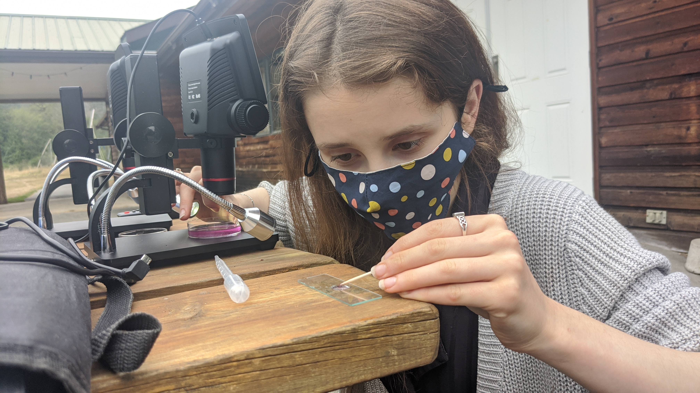

## Weaving Perspectives on Local Biodiversity

We can enrich our understanding of the Salish Sea bioregion by weaving Ingigenous and Western scientific place-based knowledge. In this spirit, eco-cultural mapping pilot project *Xetthecum* integrates biodiversity data with Indigenous knowledge and stories into an interactive map that harnesses design, data visualization and artistic practice to deepen place-based learning. *Xetthecum* is providing a basis for the work of our partners [Whiteswan Environmental](https://www.whiteswanenvironmental.org/) in mapping sites of ancestral significance across the region.

## Living Data: Preserving Legacy Datasets

How can we preserve the work of dedicated naturalists who have monitored the bioregion over decades? This is the impetus behind the Janszen Legacy Project, which aims to preserve the extensive records of renowned naturalist Harvey Janszen to inform historical baselines and overall biodiversity knowledge in the bioregion. This project also feeds into our work developing bioinformatics frameworks for tracking biodiversity data from communities across the region.
link for bioinformatics framework?

## Fostering Community-based Longterm Ecological Research

Communities have important roles to play in monitoring biodiversity in local places over the long term. This is the underpinning of long-term ecological research, and the inspiration behind the project Biogaliano, the seed from which IMERSS was formed. From [Sentinels of Change](https://sentinels.hakai.org/) dungeness crab monitoring, to our eelgrass and diatom community research, to marine lichens and local climate monitoring, we are fostering community-based efforts to better understand change in this bioregion. To connect communities involved in this work of long-term ecological research, we are partenered with the [Hakai Insitute](https://hakai.org/) on the creation of a transboundary bioregional resource, the [Community Atlas for the Salish Sea](https://salishsea.wwu.edu/islands-salish-sea-online-community-atlas).

## Supporting Cross-disciplinary Learning and Practice

IMERSS strives to foster opportunities for learning within and across communities of practice. From opportunities for youth and others to learn about microscopy through Microscopic Explorations, to internships and artist collaborations, we aim to build community and deepen knowledge through interdisciplinary place-based learning.

## Explore our Projects!

